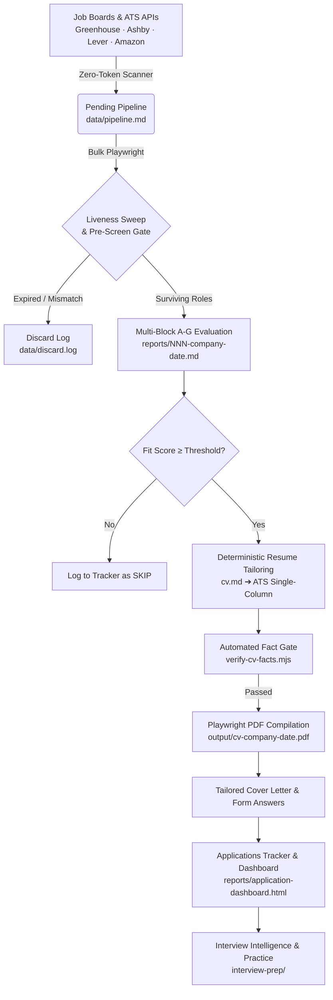

# 🚀 Job Copilot 

<p align="center">
  <strong>An intelligent, privacy-first, agentic job search operating system built for the United States tech market.</strong>
</p>

<p align="center">
  <a href="#features"></a>
  <a href="#license"></a>
  <a href="https://nodejs.org"></a>
  <a href="https://agentskills.io"></a>
  <a href="#anti-fabrication"></a>
</p>

---

## 📌 Overview

**AI Job Copilot** is a local-first, CLI-agnostic job search pipeline and resume tailoring engine. Built to run across any AI agent environment implementing the [Open Agent Skill Standard](https://agentskills.io) (**Claude Code, Antigravity CLI, OpenAI Codex, OpenCode, Cursor, Qwen, Kimi, Grok Build CLI**), it manages the full career lifecycle:

1. **Zero-Token ATS Portal Scanning** (Greenhouse, Ashby, Lever, Workday, Amazon, SmartRecruiters, iCIMS, Simplify).
2. **Deep Fit & Legitimacy Scoring** (Multi-block evaluation with Ghost Job / Legitimacy detection).
3. **Deterministic Resume & Cover Letter Tailoring** (Truth-grounded reformulation, automated fact-checking, and ATS optimization).
4. **Lifecycle Tracking & Offline Dashboard** (Local markdown tracking + standalone zero-dependency HTML dashboard).
5. **Interview Intelligence & Debriefs** (STAR+R story matching, company research, and mock interviews).

> **🛡️ Strict Human-in-the-Loop Policy:** Nothing is ever auto-submitted or sent automatically. Every evaluation, tailored artifact, and application decision is strictly reviewed and confirmed by you.

---

## ⚡ Core Architecture & Workflow



---

## ✨ Key Features

### 1. 🎯 Deterministic Resume Tailoring Engine
- **Absolute Truth Boundary:** All content is generated *exclusively* from your verified profile (`cv.md`, `config/profile.yml`, `modes/_profile.md`, verified portfolio projects).
- **Reformulate, Never Fabricate:** Automatically rewrites verified accomplishments using exact JD terminology without inventing skills, credentials, metrics, or employers.
- **Automated Fact Gate (`verify-cv-facts.mjs`):** A strict pre-render verification engine checks all numbers, percentages, dates, and tools against your source files. Unverified metrics halt compilation.
- **6-Second Recruiter Scan:** Formatted for human readability with a high-impact top third, action-first bullet structures (XYZ / ABC formats), and clean visual hierarchy.
- **ATS Compliant:** Pure single-column layouts, standard headers, selectable UTF-8 text, and exact US Letter paper sizing.

### 2. ⚡ Zero-Token Job Board Scanner (`scan.mjs` / `scan-ats-full.mjs`)
- Directly queries ATS public APIs (**Greenhouse, Ashby, Lever, Amazon, Workday, SmartRecruiters, iCIMS**) with **zero LLM token spend**.
- Intelligent deduplication against `data/scan-history.tsv` to avoid duplicate evaluations.
- High-throughput keyword sweep across hundreds of company boards in seconds.

### 3. 🔍 Multi-Block Fit & Legitimacy Evaluation
Every evaluated role produces a comprehensive report with multi-dimensional scoring:
- **Block A:** Role & Scope Match (Core PM/Tech responsibilities)
- **Block B:** Technical & AI Depth (RAG, LLM eval, SQL/Data engineering alignment)
- **Block C:** Compensation & Location Fit (Advertised range vs. candidate targets)
- **Block D:** Seniority & Experience Gate (Prevents applying to hard-mismatch seniorities)
- **Block E:** Work Authorization & Sponsorship Policy (F-1 STEM OPT / H-1B compatibility)
- **Block F:** Global Fit Score (0.0 to 5.0)
- **Block G:** Posting Legitimacy & Ghost Job Detection (Posting age, hiring signals, trust flags)

### 4. 📊 Offline Analytics & HTML Dashboard (`report:html`)
- Generates a standalone, dependency-free interactive HTML dashboard (`reports/application-dashboard.html`).
- Features inline SVG charts, funnel velocity metrics, conversion rates, and per-company status drill-downs without needing an external web server.

---

## 🛠️ Supported Skill Modes & Commands

| Mode / Command | Description |
| :--- | :--- |
| **`pipeline`** | Batch processes and evaluates all pending job URLs in `data/pipeline.md`. |
| **`scan`** | Runs zero-token portal scanner across configured targets in `portals.yml`. |
| **`auto-pipeline`** | Evaluates a single pasted job URL/text $\rightarrow$ Report $\rightarrow$ Tailored CV $\rightarrow$ Tracker. |
| **`pdf`** | Generates an ATS-optimized, tailored PDF resume for any evaluated company. |
| **`pdf --hm-audit`** | Dispatches an adversarial hiring-manager subagent to critique and audit resume bullets. |
| **`cover`** | Drafts and renders a targeted, research-backed cover letter PDF. |
| **`contacto`** | Identifies recruiters/hiring managers on LinkedIn and drafts $\le 300$-char outreach messages. |
| **`deep`** | Executes structured 6-axis company research (AI strategy, engineering culture, recent moves). |
| **`interview-prep`** | Generates company-specific intel, likely technical/behavioral questions, and STAR answer mappings. |
| **`report:html`** | Builds/refreshes the self-contained offline HTML analytics dashboard. |

---

## 🚀 Quick Start

### 1. Prerequisites
- **Node.js:** v18.0.0 or higher
- **Package Manager:** `npm` or `bun`
- **AI CLI:** [Claude Code](https://claude.ai/code), [Antigravity CLI](https://antigravity.google), [OpenAI Codex](https://github.com/openai/codex), or any Open Agent Skill CLI.

### 2. Installation

```bash
# Clone the repository
git clone https://github.com/MadanMohan0537/AI-Job-Copilot.git
cd AI-Job-Copilot

# Install dependencies
npm install

# Install Playwright browser binaries for PDF compilation & liveness checks
npx playwright install chromium
```

### 3. Onboarding & Configuration
Open the project in your AI CLI (e.g., `agy` or `claude`). The assistant will automatically run `node doctor.mjs` and guide you through configuration:

1. **Import your CV:** Provide your background to initialize `cv.md`.
2. **Profile Setup:** Configure `config/profile.yml` (Name, contact info, target roles, salary floor, location preferences).
3. **Portals Config:** Customize target companies and keyword filters in `portals.yml`.
4. **House Rules:** Add personalized procedural preferences in `modes/_custom.md`.

---

## 🔒 Data Privacy & Architecture Contract

Career-Ops strictly separates the **User Data Layer** from the **System Engine Layer**:

```
├── User Data Layer (Never overwritten by updates · Gitignored PII)
│   ├── cv.md                         # Master resume source of truth
│   ├── config/profile.yml            # Personal details, targets, comp strategy
│   ├── modes/_profile.md             # Persona, exit narrative, scoring weights
│   ├── modes/_custom.md              # Personal house rules & tailoring workflows
│   ├── portals.yml                   # Custom company tracker list
│   └── data/                         # Applications tracker, follow-ups, discard logs
│
└── System Engine Layer (Auto-updatable core)
    ├── modes/                        # Skill mode definitions (pipeline, pdf, cover, etc.)
    ├── templates/                    # HTML & LaTeX CV templates
    ├── *.mjs                         # Zero-token scanners, PDF compilers, fact verifiers
    └── reports/                      # Generated evaluation reports & HTML dashboard
```

---

## 📄 License

Distributed under the **MIT License**. See [`LICENSE`](LICENSE) for details.
